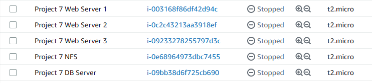
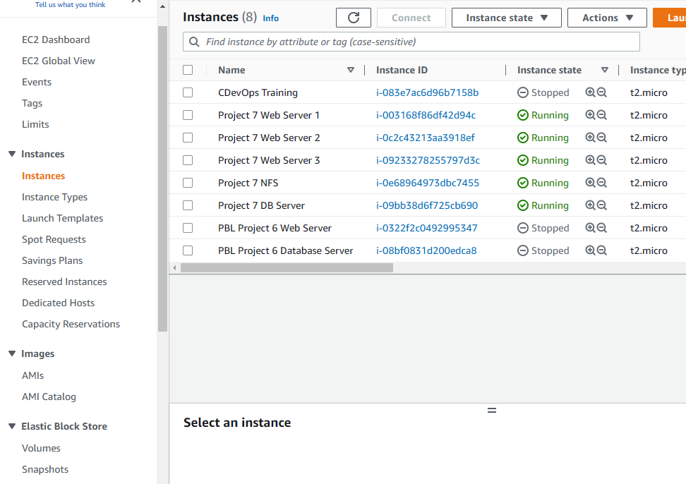
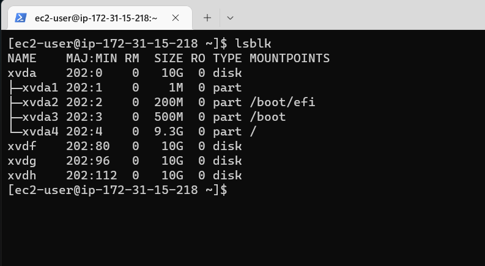
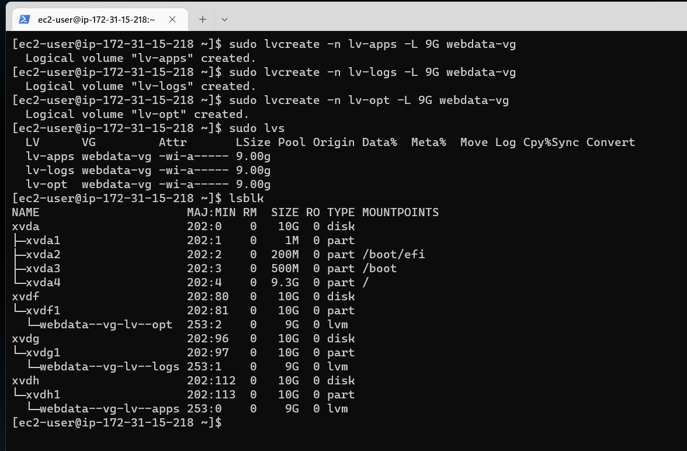
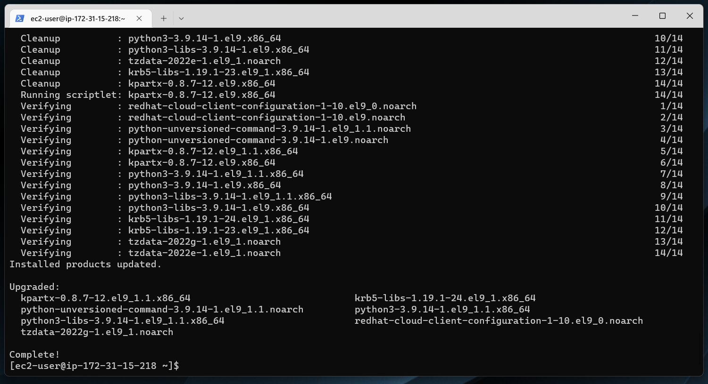
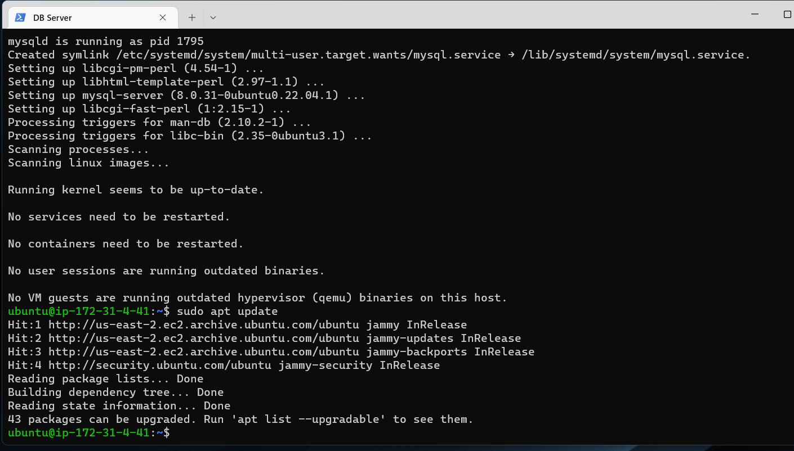
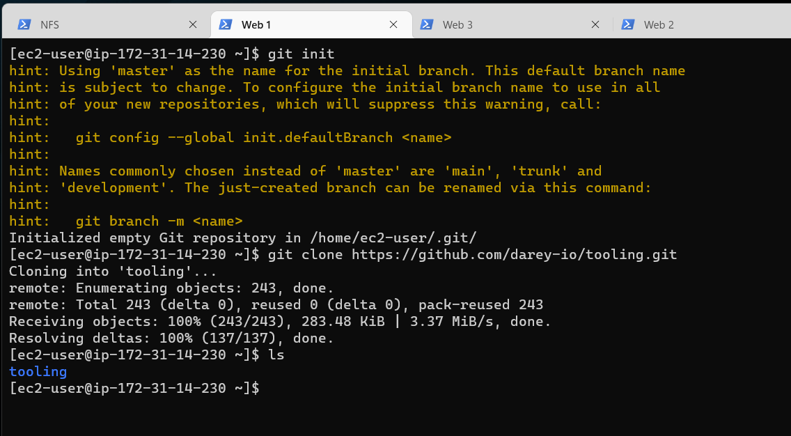
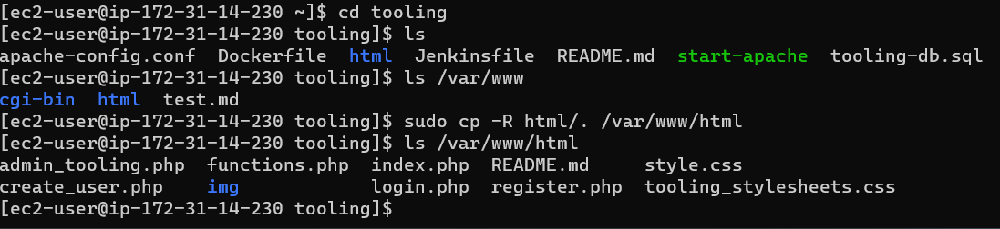

# Project 7

# (STEP 17) PROJECT 7: DEVOPS TOOLING WEBSITE SOLUTION

In previous [Project 6(https://www.darey.io/docs/project-6-step-1/) you implemented a WordPress based solution that is ready to be filled with content and can be used as a full fledged website or blog. Moving further we will add some more value to our solutions that your DevOps team could utilize. We want to introduce a set of DevOps tools that will help our team in day to day activities in managing, developing, testing, deploying and monitoring different projects.

The tools we want our team to be able to use are well known and widely used by multiple DevOps teams, so we will introduce a single DevOps Tooling Solution that will consist of:


1. Jenkins – free and open source automation server used to build CI/CD pipelines.
2. Kubernetes – an open-source container-orchestration system for automating computer application deployment, scaling, and management.
3. Jfrog Artifactory – Universal Repository Manager supporting all major packaging formats, build tools and CI servers. Artifactory.
4. Rancher – an open source software platform that enables organizations to run and manage Docker and Kubernetes in production.
5. Grafana – a multi-platform open source analytics and interactive visualization web application.
6. Prometheus – An open-source monitoring system with a dimensional data model, flexible query language, efficient time series database and modern alerting approach.
7. Kibana – Kibana is a free and open user interface that lets you visualize your Elasticsearch data and navigate the Elastic Stack.

## Setup and technologies used in Project 7
As a member of a DevOps team, you will implement a tooling website solution which makes access to DevOps tools within the corporate infrastructure easily accessible.

In this project you will implement a solution that consists of following components:

### 1. Infrastructure: AWS
### 2. Webserver Linux: Red Hat Enterprise Linux 8
### 3. Database Server: Ubuntu 20.04 + MySQL
### 4. Storage Server: Red Hat Enterprise Linux 8 + NFS Server
### 5. Programming Language: PHP
### 6. Code Repository: GitHub

On the diagram below you can see a common pattern where several stateless Web Servers share a common database and also access the same files using Network File Sytem (NFS) as a shared file storage. Even though the NFS server might be located on a completely separate hardware – for Web Servers it look like a local file system from where they can serve the same files.


It is important to know what storage solution is suitable for what use cases, for this – you need to answer following questions: what data will be stored, in what format, how this data will be accessed, by whom, from where, how frequently, etc. Base on this you will be able to choose the right storage system for your solution.

## Get Started

Log into AWS and create EC2 servers below
- 3 Web servers
- 1 db server
- 1 NFS server

  


## Step 1 – Prepare NFS Server
1. Spin up a new EC2 instance with RHEL Linux 8 Operating System.

2. Based on your LVM experience from Project 6, Configure LVM on the Server.

   - Create volume by following the steps below.

    - On the left panel click on Volumes under Elastic Block Store.

       

    - The screen below will be displayed.

      

    - You can sort the created and it will sort it by date. The 5 volumes created on 1/6/2023 were automatically created when the 5 instances were created.

      


    - Ensure there are 3 Logical Volumes. lv-opt lv-apps, and lv-logs. Create them as show below;

    - Click Create Volume.

      

    - Change the size to 10 GiB and make sure that the availabilityu zone is the same as the one you have for the instances . In this case us-east-2a. Then click create volume. Repeat this process 3 times to create 3 volumes.

      

    - If you look at the 3 created , you will see the 3 volumes created on 1/14/2023 at the top.

      

    - Select one of the volumes and under Action, click on Attach Volume.

      

      The screen below will be displayed. Select the Project 7 NFS server under instance, and click Attach Volume.

      

      Repeat the same process and attach the remaining 2 volumes. Select Project 7 NFS under insatnces the same way you did for the first volume you attached.

      

      

      Refresh.

  - Connect to the Project 7 NFS server through the terminal.

    

    To list all the blocked devises that are attached to the NFS insatnce run the command below. If will show the 3 volumes that were created for 10GiB each. It will show xvdf, xvdg and xvdh.

    `lsblk`

    


  - We now need to create a single partition in each of the 3 discs.

     For creating the first partition, run the command below;

     `sudo gdisk /dev/xvdf`

     

     If you click ? it will show you different commands that you can use.

     


     Select n to create a new partition.
     Select 1.
     Dont input anything for First Sector. Just enter.
     Dont input anything for Last sector. Just enter.
     Input 8300 .
     Select p which is to print partition table.
     Input w to save.
     Selecy Y

     


     
     Repeat the same steps for creating partition for xvdg .Run the command below;

     `sudo gdisk /dev/xvdg`

     

     
     Select n to create a new partition.
     Select 1.
     Dont input anything for First Sector. Just enter.
     Dont input anything for Last sector. Just enter.
     Input 8300 .
     Select p which is to print partition table.
     Input w to save.
     Selecy Y

     


      Repeat the same steps for creating partition for xvdh .Run the command below;

     `sudo gdisk /dev/xvdh`

     

     
     Select n to create a new partition.
     Select 1.
     Dont input anything for First Sector. Just enter.
     Dont input anything for Last sector. Just enter.
     Input 8300 .
     Select p which is to print partition table.
     Input w to save.
     Selecy Y

     


     Run `lsblk` to show you the 3 partitions that have been created.

     

   - Install the lvm2 package.

     `sudo yum install lvm2 -y`

     

  - Run `sudo lvmdiskscan` to check for available partitions.

    

3. Create physical volumes.
    
    - Run the command below to create the first physical volume for xvdf1

      `sudo pvcreate /dev/xvdf1`

      

    -  Run the command below to create the first physical volume for xvdg1

       `sudo pvcreate /dev/xvdg1`

       

    -  Run the command below to create the first physical volume for xvdh1

       `sudo pvcreate /dev/xvdh1`

       


    - Confirm that the physical volumes have been created by running the command below.

      `sudo pvs`

      


4. Create volume groups.
    - Creating a volume group packages all the physical volumes into one package.
    
    - Run the command below to create the volume group.

      `sudo vgcreate webdata-vg /dev/xvdh1 /dev/xvdg1 /dev/xvdf1`

      


    - Confirm that the Volume Group has been created by running the command below.

      `sudo vgs`

      


5. Ensure there are 3 Logical Volumes. lv-opt lv-apps, and lv-logs.

   - Run the command below to create lv-apps. Give it 9G.

     `sudo lvcreate -n lv-apps -L 9G webdata-vg`

     


     
    - Run the command below to create lv-logs. Give it 9G.

      `sudo lvcreate -n lv-logs -L 9G webdata-vg`

      


    - Run the command below to create lv-opt. Give it 9G. For this project we will not be using the opt logical volume. We will not mount it to the web server as we will not be using it.

      `sudo lvcreate -n lv-opt -L 9G webdata-vg`

      


    - Confirm that the logical volumes have been created by running the command below.

      `sudo lvs`

      

   - To see everything that you have created, run the command below.

      `sudo lsblk`

      


   - To view the complete setup (physical volume, volume group and logical volume), run the command below.


     `sudo vgdisplay -v`

     

     

     

     

6. Format the disks as xfs format instead of ext4.

    - Run the command below to format lv-apps

      `sudo mkfs -t xfs /dev/webdata-vg/lv-apps`

      


 - Run the command below to format lv-logs

      `sudo mkfs -t xfs /dev/webdata-vg/lv-logs`

      


 - Run the command below to format lv-opt

      `sudo mkfs -t xfs /dev/webdata-vg/lv-opt`

      

7. Create mount points on /mnt directory for the logical volumes as follow:

   -  Mount lv-apps on /mnt/apps – To be used by webservers
   - Mount lv-logs on /mnt/logs – To be used by webserver logs
   - Mount lv-opt on /mnt/opt – To be used by Jenkins server in Project 8

     -  Create /mnt/apps directory by running the command below.
     `sudo mkdir /mnt/apps`

        


       -  Create /mnt/logs directory by running the command below.
     `sudo mkdir /mnt/logs`

          


        -  Create /mnt/opt directory by running the command below.
     `sudo mkdir /mnt/opt`

           

 8. Next step now is to mount. 
 
    - Start mounting lv-apps by the command below.

      `sudo mount /dev/webdata-vg/lv-apps /mnt/apps`

      


    -  Next mount lv-logs by the command below.

       `sudo mount /dev/webdata-vg/lv-logs /mnt/logs`

         


    - Last mount lv-opt by the command below.

       `sudo mount /dev/webdata-vg/lv-opt /mnt/opt`

         

9.  Install NFS server, configure it to start. Reboot and make sure it is up and running. Run the commands below.

    Update

    `sudo yum -y update`

    

    Install nfs utils

    `sudo yum install nfs-utils -y`

    

    Start nfs server

    `sudo systemctl start nfs-server.service`

    

    Enable nfs server

    `sudo systemctl enable nfs-server.service`

    

    Check status of nfs server

    `sudo systemctl status nfs-server.service`

    


    Make sure we set up permission that will allow our Web servers to read, write and execute files on NFS:

    These immeadiate commands is to change the ownership.

    `sudo chown -R nobody: /mnt/apps`

    `sudo chown -R nobody: /mnt/logs`

    `sudo chown -R nobody: /mnt/opt`

    


    The second set is to set up permissions to allow the web servers to read, write and execute files on NFS.

    `sudo chmod -R 777 /mnt/apps`

    `sudo chmod -R 777 /mnt/logs`

    `sudo chmod -R 777 /mnt/opt`

    

    Restart

    `sudo systemctl restart nfs-server.service`

  

    


    Confirm that server is back up and running by running the command below.

    `sudo systemctl status nfs-server.service`

    


    Configure access to NFS for clients within the same subnet (example of Subnet CIDR – 172.31.32.0/20 ): After you run the command `sudo vi /etc/exports`, copy and paste the text below to the file.

    ```

    sudo vi /etc/exports

    /mnt/apps <Subnet-CIDR>(rw,sync,no_all_squash,no_root_squash)
    /mnt/logs <Subnet-CIDR>(rw,sync,no_all_squash,no_root_squash)
    /mnt/opt <Subnet-CIDR>(rw,sync,no_all_squash,no_root_squash)

    Esc + :wq!

    sudo exportfs -arv
    ```

    Replace the subnet information. To get the subnet information.
    
    - Go to the AWS console 
    - Project 7 NFS instance
    - Networking and then click under Subnet ID

      

    - It will open VPC Management Console as shown below.

      

    - Copy the subnet information below and replace with the information in the file.

      172.31.0.0/20

    
       

       Save by `:wq!`

       

       Run the command below to confirm that the exports were successfull.

       `sudo exportfs -arv`

       

10. Check which port is used by NFS and open it using Security Groups (add new Inbound Rule).

    `rpcinfo -p | grep nfs`

    


    Important note: In order for NFS server to be accessible from your client, you must also open following ports: TCP 111, UDP 111, UDP 2049.


    To open the ports, follow the steps below;

     - Go to Instances under AWS Console and then select Project 7 NFS.


       

      - Select Security and click on Security Groups

        

      - Click on Edit Inbound Rules

        

      - Click Add Rule and then add all the rules mentioned. Make sure you use the subnet IP address and Save as shown below.


        

        It will show that the inbound security group has been successfully modified.

        


## STEP 2 — CONFIGURE THE DATABASE SERVER

  - Connect to the Project 7 DB Server through ssh.

    

  - Install MySQL server by running the command below and click y when prompted.

    `sudo apt install mysql-server`

    

    

  - Run `sudo apt update` to run an update.

    

  - Login to the mysql.

    `sudo mysql`

    

  - Create a database and name it tooling.

    `create database tooling;`

    

  - Create a database user and name it webaccess. To do this you will need to get the IP address for the Project 1 Web Server subnet.

    - How to get the subnet information;

      - Go to AWS console, click on instances and select Project 7 Web Server 1.

        

      - Click on Networking and then Sunnet ID.

        

      - You can get the information from the screen below.

        172.31.0.0/20

         

    Now create the user with the information. Run the command below.

    `create user 'webaccess'@'172.31.0.0/20' identified by 'password';`

    This means that the password used is *password*.

    

   - Grant permission to webaccess user on tooling database to do anything only from the webservers subnet cidr. 

     `grant all privileges on tooling.* to 'webaccess'@'172.31.0.0/20';`

     

  - Flush privileges.


    `flush privileges;`

    

  - Show databses.

    `show databases;`

    


  - Use tooling.

    `use tooling;`

    


  - Show tables.

    `show tables;`

    


## Step 3 — Prepare the Web Servers

 - Go to AWS console and connect to Project 7 Web Server 1 using ssh.

   

   We need to make sure that our Web Servers can serve the same content from shared storage solutions, in our case – NFS Server and MySQL database.
   
   You already know that one DB can be accessed for *reads* and *writes* by multiple clients. For storing shared files that our Web Servers will use – we will utilize NFS and mount previously created Logical Volume *lv-apps* to the folder where Apache stores files to be served to the users *(/var/www).*
   
   This approach will make our Web Servers *stateless,* which means we will be able to add new ones or remove them whenever we need, and the integrity of the data (in the database and on NFS) will be preserved.
   
   During the next steps we will do following:

    - Configure NFS client (this step must be done on all three servers).
    - Deploy a Tooling application to our Web Servers into a shared NFS folder
    - Configure the Web Servers to work with a single MySQL database


1. Install NFS client

   `sudo yum install nfs-utils nfs4-acl-tools -y`

   

2. Mount /var/www/ and target the NFS server’s export for apps.

   First create the directory /var/www
  
  
   `sudo mkdir /var/www`

   

   Mount

   `sudo mount -t nfs -o rw,nosuid<NFS-Server-Private-IP-Address>:/mnt/apps /var/www`

   You can get the NFS Private IP from AWS console in the NFS server. Remember to use the Private IP.

   

   It is : 172.31.15.218

   Below is now the command you need to run.

    `sudo mount -t nfs -o rw,nosuid 172.31.15.218:/mnt/apps /var/www`

    

3. Verify that NFS was mounted successfully by running `df -h`. Make sure that the changes will persist on Web Server after reboot:

   It will show the NFS server with IP address, 172.31.15.218.


   

   `sudo vi /etc/fstab`

   add following line

   `<NFS-Server-Private-IP-Address>:/mnt/apps /var/www nfs defaults 0 0`

   Get the NFS server private IP from the AWS console as you did before and replace it. Add the updated text below.


   `172.31.15.218:/mnt/apps /var/www nfs defaults 0 0`

   

   Save by ESC,Shift :wq! Enter.

   


4. Install Remi’s repository, Apache and PHP

   `sudo yum install httpd -y`

   

   `sudo dnf install https://dl.fedoraproject.org/pub/epel/epel-release-latest-8.noarch.rpm`

   

   `sudo dnf install dnf-utils http://rpms.remirepo.net/enterprise/remi-release-8.rpm`

   

   `sudo dnf module reset php`

   

   Enable dnf module

   `sudo dnf module enable php:remi-7.4`

   

   Install php

   `sudo dnf install php php-opcache php-gd php-curl php-mysqlnd`

   

   Start php

   `sudo systemctl start php-fpm`

   

   Enable php

   `sudo systemctl enable php-fpm`

   

   `sudo setsebool -P httpd_execmem 1`

   


## Repeat steps 1-4 for the other 2 Web Servers.

  - Lets start with Project 7 Web Server 2

  - Login to Project 7 Web Server 2 through ssh.

  1. Install NFS client

     `sudo yum install nfs-utils nfs4-acl-tools -y`

     

2. Mount /var/www/ and target the NFS server’s export for logs.

   First create the directory /var/www
  
  
   `sudo mkdir /var/www`

   

   Mount

   `sudo mount -t nfs -o rw,nosuid<NFS-Server-Private-IP-Address>:/mnt/logs /var/www`

   You can get the NFS Private IP from AWS console in the NFS server. Remember to use the Private IP.

   

   It is : 172.31.15.218

   Below is now the command you need to run.

    `sudo mount -t nfs -o rw,nosuid 172.31.15.218:/mnt/logs /var/www`

    

3. Verify that NFS was mounted successfully by running `df -h`. Make sure that the changes will persist on Web Server after reboot:

   It will show the NFS server with IP address, 172.31.15.218.


   

   `sudo vi /etc/fstab`

   add following line

   `<NFS-Server-Private-IP-Address>:/mnt/logs /var/www nfs defaults 0 0`

   Get the NFS server private IP from the AWS console as you did before and replace it. Add the updated text below.


   `172.31.15.218:/mnt/logs /var/www nfs defaults 0 0`

   

   Save by ESC,Shift :wq! Enter.

   


4. Install Remi’s repository, Apache and PHP

   `sudo yum install httpd -y`

   

   `sudo dnf install https://dl.fedoraproject.org/pub/epel/epel-release-latest-8.noarch.rpm`

   

   `sudo dnf install dnf-utils http://rpms.remirepo.net/enterprise/remi-release-8.rpm`

   

   `sudo dnf module reset php`

   

   Enable dnf module

   `sudo dnf module enable php:remi-7.4`

   

   Install php

   `sudo dnf install php php-opcache php-gd php-curl php-mysqlnd`

   

   Start php

   `sudo systemctl start php-fpm`

   

   Enable php

   `sudo systemctl enable php-fpm`

   

   `sudo setsebool -P httpd_execmem 1`

   


   
  - Lastly lets move on to Project 7 Web Server 3

  - Login to Project 7 Web Server 3 through ssh.

1. Install NFS client

     `sudo yum install nfs-utils nfs4-acl-tools -y`

     

2. Mount /var/www/ and target the NFS server’s export for opt.

   First create the directory /var/www
  
  
   `sudo mkdir /var/www`

   

   Mount

   `sudo mount -t nfs -o rw,nosuid<NFS-Server-Private-IP-Address>:/mnt/opt /var/www`

   You can get the NFS Private IP from AWS console in the NFS server. Remember to use the Private IP.

   

   It is : 172.31.15.218

   Below is now the command you need to run.

    `sudo mount -t nfs -o rw,nosuid 172.31.15.218:/mnt/opt /var/www`

    

3. Verify that NFS was mounted successfully by running `df -h`. Make sure that the changes will persist on Web Server after reboot:

   It will show the NFS server with IP address, 172.31.15.218.


   

   `sudo vi /etc/fstab`

   add following line

   `<NFS-Server-Private-IP-Address>:/mnt/opt /var/www nfs defaults 0 0`

   Get the NFS server private IP from the AWS console as you did before and replace it. Add the updated text below.


   `172.31.15.218:/mnt/opt /var/www nfs defaults 0 0`

   

   Save by ESC,Shift :wq! Enter.

   


4. Install Remi’s repository, Apache and PHP

   `sudo yum install httpd -y`

   

   `sudo dnf install https://dl.fedoraproject.org/pub/epel/epel-release-latest-8.noarch.rpm`

   

   `sudo dnf install dnf-utils http://rpms.remirepo.net/enterprise/remi-release-8.rpm`

   

   `sudo dnf module reset php`

   

   Enable dnf module

   `sudo dnf module enable php:remi-7.4`

   

   Install php

   `sudo dnf install php php-opcache php-gd php-curl php-mysqlnd`

   

   Start php

   `sudo systemctl start php-fpm`

   

   Enable php

   `sudo systemctl enable php-fpm`

   

   `sudo setsebool -P httpd_execmem 1`

   


5. Verify that Apache files and directories are available on the Web Server in /var/www and also on the NFS server in /mnt/apps. If you see the same files – it means NFS is mounted correctly. You can try to create a new file touch test.txt from one server and check if the same file is accessible from other Web Servers.(Note the test.txt was already created in Web Server 1, so there is no need to recreate in Web Server 1.)

    - Run the command below on Project 7 Web Server 1. You will see that *cgi-bin and html* were created when apache was installed.

      `ls /var/www`

      

    - Run the same command below on the NFS server. You will see that *cgi-bin and html* were also created.

      `ls /mnt/apps`

      

     - Run the command below on Project 7 Web Server 2. You will see that *cgi-bin and html* were created when apache was installed.

       `ls /var/www`

       

       Run the command below in Web Server 2 to create the file *test.md*. 

       `sudo touch /var/www/test.md`

       

       Run `ls /var/www` and you will see that the file was created.

       


    - Run the same command below on the NFS server. You will see that *cgi-bin, html and test.md* were also created.

      `ls /mnt/logs`

      


      - Run the command below on Project 7 Web Server 3. You will see that *cgi-bin and html* were created when apache was installed.

       `ls /var/www`

       

       Run the command below in Web Server 3 to create the file *test.md*. 

       `sudo touch /var/www/test.md`

       

       Run `ls /var/www` and you will see that the file was created.

       


    - Run the same command below on the NFS server. You will see that *cgi-bin, html and test.md* were also created.

      `ls /mnt/opt`

      

6. Locate the log folder for Apache on the Web Server and mount it to NFS server’s export for logs. Repeat step №4 to make sure the mount point will persist after reboot.


   - Run the command below on Project 7 Web Server 1 to mount the log folder for Apache. Get the NSF Private IP and replace it.

     `sudo mount -t nfs -o rw,nosuid <NFS-Server-Private-IP-Address>:/mnt/logs /var/log/httpd`

     You can get the NFS Private IP by selecting the NFS server from AWS console. The Provate IP will be under details. Below is the Private IP for NFS and the updated code.

     172.31.15.218

      `sudo mount -t nfs -o rw,nosuid 172.31.15.218:/mnt/logs /var/log/httpd`

      


      Run the command below to ensure that the mount point will persist after reboot.

      `sudo vi /etc/fstab`

      The screen below will open up.

      

      Add the text below to the file and save using esc, shift :wq!

      172.31.15.218:/mnt/logs /var/log/httpd nfs defaults 0 0

      


      Repeat the steps above for Project 7 Web Server 2

    - Run the command below on Project 7 Web Server 1 to mount the log folder for Apache. Get the NSF Private IP and replace it.

      `sudo mount -t nfs -o rw,nosuid <NFS-Server-Private-IP-Address>:/mnt/logs /var/log/httpd`

      You can get the NFS Private IP by selecting the NFS server from AWS console. The Provate IP will be under details. Below is the Private IP for NFS and the updated code.

      172.31.15.218

      `sudo mount -t nfs -o rw,nosuid 172.31.15.218:/mnt/logs /var/log/httpd`

      


      Run the command below to ensure that the mount point will persist after reboot.

      `sudo vi /etc/fstab`

      The screen below will open up.

      

      Add the text below to the file and save using esc, shift :wq!

      172.31.15.218:/mnt/logs /var/log/httpd nfs defaults 0 0

      


      Repeat the steps above for Project 7 Web Server 3

    - Run the command below on Project 7 Web Server 1 to mount the log folder for Apache. Get the NSF Private IP and replace it.

      `sudo mount -t nfs -o rw,nosuid <NFS-Server-Private-IP-Address>:/mnt/logs /var/log/httpd`

      You can get the NFS Private IP by selecting the NFS server from AWS console. The Provate IP will be under details. Below is the Private IP for NFS and the updated code.

      172.31.15.218

      `sudo mount -t nfs -o rw,nosuid 172.31.15.218:/mnt/logs /var/log/httpd`

      


      Run the command below to ensure that the mount point will persist after reboot.

      `sudo vi /etc/fstab`

      The screen below will open up.

      

      Add the text below to the file and save using esc, shift :wq!

      172.31.15.218:/mnt/logs /var/log/httpd nfs defaults 0 0

      


7. Fork the tooling source code from Darey.io Github Account to your Github account. (Learn how to fork a repo here)

  - Click on the link below for Darey.io github account.

     https://github.com/darey-io/tooling

     The screen below will be displayed.

     


     Click Code and copy the https link.

     

     Below is the link.

     https://github.com/darey-io/tooling.git

8. Deploy the tooling website’s code to the Webserver. Ensure that the html folder from the repository is deployed to */var/www/html*

     Go the terminal for Project 7 Web Server 1 and install git using the command below.

     `sudo yum install git`

     

     Run `git init`

     


     Stay on terminal for Project 7 Web Server 1 and run the command below to clone.

     `git clone https://github.com/darey-io/tooling.git`

     

     Run `ls` and you will see tooling.

     

     Change directory to tooling by running `cd tooling` and then `ls`, you will see several files.

     

  
  
     To Ensure that the html folder from the repository is deployed to */var/www/html*;

     - Run `ls /var/www`. Make sure you are on the tooling directory. You will see the html file.


       


      -  Copy the html that was in the tooling directory to /var/www/html

         `sudo cp -R html/. /var/www/html`

      
         

        
      - Run `ls /var/www/html`. You will see the files that are contained in html. Running `ls html` will provide the same results.

          

10. Go to the web servers and open TCP port 80 .

      - Select Project 7 Web Server 1 , Security and then click on security groups.

        

      - Click edit Inbound rules, then add rules.

        

      - Under Type input HTTP, under Source put 0.0.0.0/0 and then save rules.

        

      - Check if apache is running by running the command below.

        `sudo systemctl status httpd`

        It shows that it is inactive.

        

      - Disable SELinux 

        `sudo setenforce 0`

        


      - To make this change permanent – open following config file `sudo vi /etc/sysconfig/selinux` and set *SELINUX=disabled then restrt httpd.*

        

         Make the changes (SEKinux=disabled) and then save through esc, :wq!

        

      - Start apache by running the command below.

        `sudo systemctl start httpd`

        

        - Check the status of apache by running the command below.

        `sudo systemctl status httpd`

        

11. Change directory to tooling and install mysql. click Y when prompted during installation.

    `cd tooling`

    

    `sudo yum install mysql`

    

  - Go to Project 7 DB server through the AWS console . Allow mysql / Aurora by clicking Security > Security groups > Edit Inbound rules. Under Type , select MYSQL / Aurora and subnet IP for Project 7 web 1 (This can be got by selecting Web server 1, Networking and clicking subnet. It is 172.31.0.0/16). Add rule and save.

    

12. Go to the terminal of Project 7 DB to check the status of mysql by running the command below.

    `sudo systemctl status mysql`


    

    Run the command below in db server.

    `sudo vi /etc/mysql/mysql.conf.d/mysqld.cnf`

    

    You need to change the bind address and mysqlx-bind-address to 0.0.0.0 and save as shown below.


    


    Restart mysql.

    `sudo systemctl restart mysql`

    


    Check mysql status.

    `sudo systemctl status mysql`

    


13. Update the website’s configuration to connect to the database (in /var/www/html/functions.php file). Apply tooling-db.sql script to your database using this command mysql -h <databse-private-ip> -u <db-username> -p <db-pasword> < tooling-db.sql


    - Run the command below in the Web server 1.

      `sudo vi /var/www/html/functions.php`

      The screen below will be displayed.

      

    - Press i for insert then replace the first line below with the second line. The IP address is the DB server private IP address.

    $db = mysqli_connect('mysql.tooling.svc.cluster.local', 'admin', 'admin', 'tooling');

    $db = mysqli_connect('172.31.4.41', 'webaccess', 'password', 'tooling');


    This is how it will look like. Save it by pressing esc, :wq!

    

  - Run the command below. Ensure that you are still under the tooling directory.

    `mysql -h 172.31.4.41 -u webaccess -p tooling < tooling-db.sql`

    Put password as 'password' when prompted for password.

    

- Go back to Project 7 Db server and run the commands below.

    `show databases;`

    `use tooling;`

    `show tables;`

    `select * from users;`

    

14.Open the website in your browser http://<Web-Server-Public-IP-Address-or-Public-DNS-Name>/index.php


  -  I have used the public IP for Project 7 Web Server 1.


        http://3.22.66.219

      Below page will be shown.

      

  - Make sure you can login into the website with myuser user.

    Username : admin

    Password : admin

    The screen below will be displayed when you are logged.


    


  - We have just implemented a web solution for a DevOps team using LAMP stack with remote Database and NFS servers.

  Complete!
      


      


          


      


      


      


      


   


     


    


    


